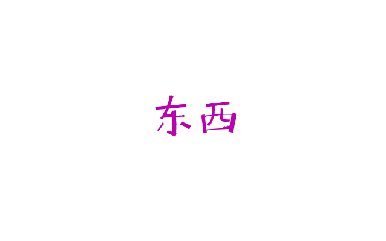

# Dongxi.js

v0.0.1

**这不是一个已经发布的商业版本产品！但你可以通过 MIT 许可使用它。**

实验基于 “筑构单元" (build unit) 的浏览器环境 JavaScript 开发。

# 欢迎项目展示

如果你使用 Dongxi.js 进行了开发，欢迎将相关情况告诉我们，在这里可以展示。

# 扩展包（Extension Package）

 * [EP1](./README.EP1.md) -- 加入了 "environment" ，用于处理事件。

# 受影响于……

很久以前看过一个类库有一个想法是“自定义标签元素”，库名不太清楚得记得了……

这个想法已经在今天被很多类库实现。现在来看，这些类库都有相关的实践，或者一些其他的东西：

 * [polymer](https://polymer-library.polymer-project.org/)
 * [vue.js](http://vuejs.org/)
 * [dojo](https://dojotoolkit.org/)
 * ... 还有很多！
 
创新是重要的！为了更好的创新 Dongxi.js 消化吸收了大量这些类库的一些概想。

# 但 Dongxi.js ...

1. 由开发者手动管理内部运行状态，即可能手动创建标签元素，尽可能不使用“自动”，“绑定”，“渲染”，“模板”这类的过程。

2. 分为“节点”，“筑构单元”，“程序”，三个层次。节点是由筑构器创建的。筑构器是开发者定义的。最终，程序调用筑构器。通过 “语义” 和 “连接” 使得相互之间协调运行。

3. “筑构单元”应当是是可以自定义、管理和可以复用的。

# 快速上手

## 例子

可以在 `example` 看到一些例子。他们分别跟这些相关：

| 例子                 | 相关                    | 说明                                                        |
|----------------------|-------------------------|-------------------------------------------------------------|
| simple               | manage API              | 一个十分简单的单纯的演示，几乎没有任何功能。                |
| red_font             | manage API, builder API | 通过改写 manage API 实现红色字体。调用 builder.make 的示例。|
| many_font            | manage API, builder API | 多次调用 builder.make 的示例。                              |
| conection            | manage API, builder API | 调用 builder.make('connection', {}) 的示例。                |
| custom_unit          | manage API, builder API | 自定义筑构单元的简单示范。                                  |
| custom_unit2         | manage API, builder API | 使用列表数据多次使用自定义筑构单元。                        |
| connection_structure | manage API, builder API | 使用 connection 中的下级元素的自动创建的 index 属性。       |

## 最少安装和调用

导入 Dongxi.js 文件：

```html
<script src="src/Dongxi.js"></script>
```

调用主函数：

```javascript
Dongxi.manage.main()
```

# 概述

Dongxi.js 的 API 包括 helpers API ， builder API 和 manage API。他们通过 Dongxi 访问:

```javascript

var mybuilder1 = Dongxi.builder('mybuilder1');

bulder1.units["myunit1"] = function(){
	//...
} 

Dongxi.manage.run = function(){
	var myunit1 = mybuilder1.make('myunit1', {})
	//...
}

Dongxi.manage.main()
```

# helpers API

一般不会用到 helpers api 。

# builder API

通过 builder API 可以自定义筑构单元，进行筑构单元的创建。

## 筑构器（builder），类别（sort），筑构信息（info），类别特有信息，导出节点（node）

筑构单元是通过筑构器创造的，并且最后形成为一个导出节点（node）。

进行一次筑构，需要向筑构器提供两个参数：类别（sort）和筑构信息（info）。

类别包括原始类别（native sort）和自定义类别（custom sort）。

筑构信息包括类别无关筑构信息（sort-independent）和特有信息。

## 清单： 类别无关筑构信息

这些筑构信息是与类别无关的，他们被用到任何的筑构单元的筑构的过程中。

| 域                              |  效果                                                   |
|---------------------------------|---------------------------------------------------------|
| info.inter       :: \[a,b,c,d\] |  导出节点的上，右，下，左内间距（padding）。            |
| info.outer       :: \[a,b,c,d\] |  导出节点的外间距（margin）。                           |
| info.width       :: \[a,b,c\]   |  导出节点的宽度，最小宽度，最大宽度。(width)            |
| info.height      :: \[a,b,c\]   |  导出节点的高度，最小高度，最大高度。(width)            |
| info.stroke      :: \[a,b,c,d\] |  导出节点的边缘笔画。（border）                         |
| info.types       :: \["s"...\]  |  导出节点的类型信息。这会在节点上形成同名属性。         |
| info.identifiers :: "s..."      |  导出节点的识别信息。这会设置为节点的 identifiers 属性。|

这是在 $builder.prefab(tagName, options) 实现的。（参考下文 API: `$builder.prefab` 。）

## API： Dongxi.builder(name, options? )

取回名为 name 的筑构器，如果没有，则新建一个。

```javascript
var mybuilder1 = Dongxi.builder('mybuilder1')
```

## API: $builder.prefab(tagName, info)

创建一个标签为 tagName 的节点，并且返回。并根据 info 进行设置。

## API： $builder.make(sort, info)

以 info 为筑构信息，创建一个类别名为 sort 的筑构单元。一般地，这个过程可以又调用了 $builder.prefab 和 $builder.make 。

如果 sort 为一个已经定义的筑构单元，则调用该筑构单元。

$builder.make 返回的是一个一般的 HTML Node 。

## API： $builder.makeMany(ainfos, f)

筑构多个筑构单元。

ainfos 是一个每个元素形如 { sort: "", info: {} } 的数组。f 是一个形如 function(_node) 的函数。

$builder.makeMany 会将 ainfos 的每个元素代入 $builder.make(sort, info) ，并将导出的节点导出给函数 f 。

## 清单： 一些实现了的筑构单元

| 类别（sort)      |  特有信息                             |
|------------------|---------------------------------------|
| "text"           |  info.text 用于指定显示的文本。       |
| "image"          |  info.src 用于指定显示的图像的位置。  |
| "button"         |  info.text 用于指定显示的文本。       |
| "input"          |  info.value 用于指定初始的文本输入。  |
| "connection"     |  info.ports 用于指定每个子端筑构单元。|
| "stage"          |  info.created 创建的时间。              |

## API: $builder.units["BUILD_UNIT_NAME"] :: function(info)

通过赋值 $builder.units\["BUILD_UNIT_NAME"\] 指定名为 "BUILD_UNIT_NAME" 的筑构单元。

已经赋值了的筑构单元可以通过 $builder.make("BUILD_UNIT_NAME", info) 创建。

## 例子： 筑构单元 "text" 的设置

这是已经实现了的对筑构单元 "text" 的设置：

```javascript
	units.text = function(info){
		var node = this.prefab('span', info);
		node.innerText = info.text;
		return node;
	}
```

## 更多筑构单元的例子

在 `example\custom_unit` 也有一个例子，这个例子筑构了一个筑构单元 "fruit" 。

# manage API

## API: Dongxi.manage.runOptions :: {...}

对于程序级的参数，一般通过 manage.runOptions 来设置。在实践中，这些参数不应该过多。

manage.runOptions 与 builder 是无关的。

## API: Dongxi.manage.main :: function(runOptions)

传入的 runOptions 将会覆盖 Dongxi.manage.runOptions 。在之后，则会执行 Dongxi.manage.run 。

## API: Dongxi.manage.run :: function()

可以改写这个函数。这个函数会在 Dongxi.manage.main 中调用。

# 更多例子

可在 ["example"](./example) 中找到一些例子。

# 字体

头图的字体是 “喜鹊在山林” 字体。

